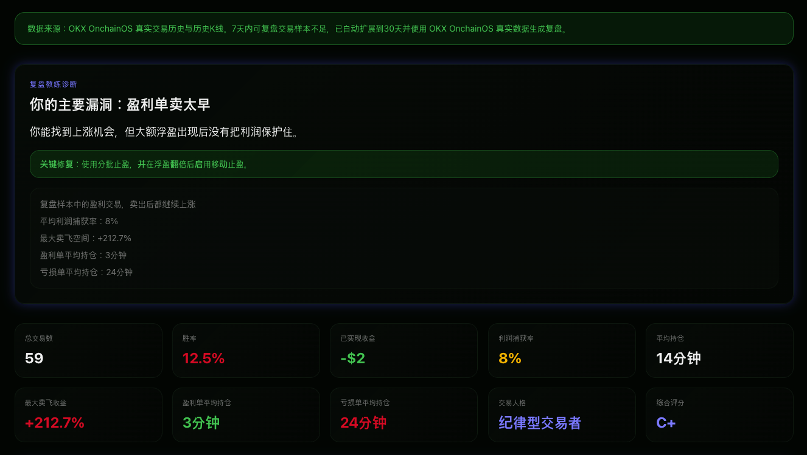

# Trading Behavior Lab
 
交易行为实验室

Trading Behavior Lab is a Web3 wallet trade replay prototype focused on trader behavior analysis. Instead of telling users what token to buy next, it helps users review how they behaved in previous trades: entry quality, exit quality, missed upside, drawdown, profit capture, repeated mistakes, and rule improvements.

## Current Status

This project is currently a mock-first frontend prototype.

- The default demo flow uses mock wallet trade data from `src/data/mockWalletAnalysis.ts`.
- The app includes deterministic analysis functions and UI modules for the full replay experience.
- The codebase contains reserved adapter boundaries for future OKX OnchainOS / Solana integration.
- The project should not be described as a production OnchainOS integration yet.
- No real API keys are included in this repository.
- This is analysis-only software. It does not execute trades, sign transactions, custody assets, or provide direct buy/sell recommendations.

## Why This Exists

Most crypto tools focus on alpha discovery. Trading Behavior Lab focuses on behavior replay:

- Did the wallet buy too late?
- Did it sell too early?
- Did winners continue higher after exit?
- Did losers stay open much longer than winners?
- Which exit strategy would have performed better on the same historical path?

The goal is not to predict the next trade. The goal is to make previous trading behavior easier to inspect.

## Features

- Wallet input with chain and period selection.
- Empty initial state: no default wallet data appears before the user submits an address.
- Summary metric cards:
  - Total trades
  - Win rate
  - Realized PnL
  - Average hold time
  - Profit capture rate
  - Max missed upside
  - Winner and loser hold behavior
  - Trading personality
  - Overall grade
- Overall diagnosis card.
- Trading personality module with evidence text.
- Drawdown behavior analysis.
- Top trading leaks.
- Personalized rule suggestions.
- What If Replay Simulation:
  - Staged Take Profit
  - Trailing Stop
  - Time Stop
  - Capital Protection
- Shareable report card.
- Paginated trade replay cards.
- Chinese / English UI toggle.
- Fallback-aware server route for future adapter-backed analysis.

## Technology Stack

- Next.js 16
- React 19
- TypeScript
- Tailwind CSS
- Radix UI primitives
- lucide-react icons
- undici for optional server-side proxy-aware requests

## Install

```bash
npm install
```

The original generated project includes `pnpm-lock.yaml`, but the scripts in `package.json` are standard npm scripts. The commands below are aligned with the current `package.json`.

## Run Development Server

```bash
npm run dev
```

Open:

```text
http://localhost:3000
```

## Build

```bash
npm run build
```

## Start Production Build

```bash
npm run start
```

## Environment Variables

Do not commit real credentials.

`.env.local.example`:

```bash
OKX_API_KEY=
OKX_SECRET_KEY=
OKX_PASSPHRASE=
OKX_PROJECT_ID=
```

`.env.local` is ignored by git.

At the current stage, the project documentation should be read as: currently uses mock data, with OnchainOS adapter reserved for integration.

## Project Structure

```text
app/
  api/analyze-wallet/route.ts     Server route for analysis and fallback behavior
  layout.tsx                      App metadata and root layout
  page.tsx                        Main dashboard page

components/dashboard/
  dashboard-header.tsx            Header and language switch
  wallet-input.tsx                Wallet input form
  metric-cards.tsx                Summary metric cards
  overall-diagnosis.tsx           Top diagnosis card
  trading-personality.tsx         Personality module
  drawdown-behavior.tsx           Drawdown analysis panel
  trading-leaks.tsx               Top leaks list
  personalized-rules.tsx          Rule suggestions
  what-if-simulation.tsx          Strategy simulation panel
  trade-replay-cards.tsx          Paginated trade replay cards
  degen-report-card.tsx           Report card component

src/data/
  mockWalletAnalysis.ts           Mock analysis dataset and shared types

src/lib/analysis/
  calculateEntryScore.ts          Entry score logic
  calculateExitScore.ts           Exit score logic
  profitCapture.ts                Profit capture / giveback logic
  tradingPersonality.ts           Personality classification
  tradingLeaks.ts                 Leak detection
  personalizedRules.ts            Rule generation
  whatIfSimulation.ts             What-if simulation strategies
  drawdownBehavior.ts             Drawdown behavior metrics
  reportCard.ts                   Report card generation

src/lib/adapters/
  okxAdapter.ts                   Reserved OKX-style adapter implementation
  okxClient.ts                    Reserved signed OKX client wrapper
  solanaAdapter.ts                Reserved Solana adapter interface
```

## Analysis Model

Each replayable trade can contain:

- Token symbol and token address
- Buy time and sell time
- Hold duration
- Buy price and sell price
- Realized PnL
- Max upside
- Max drawdown
- Profit capture rate
- Entry score
- Exit score
- Mistake tags
- Diagnosis
- Suggested fix
- Minute-level price path

The scoring and simulations are deterministic product-prototype logic. They are not audited trading models.

## What If Replay Simulation

The app compares actual exits with four rule-based exit models:

1. Staged Take Profit
   - TP1 +80%, sell 30%
   - TP2 +150%, sell 30%
   - TP3 +300%, sell 30%
   - Remaining 10% moonbag
   - Stop loss -30%

2. Trailing Stop
   - Activates after +100% unrealized PnL
   - Exits after 35% pullback from peak
   - Stop loss -30%

3. Time Stop
   - Exits if no +30% move appears within 20 minutes
   - Stop loss -30%
   - Sells at least 50% after +100%

4. Capital Protection
   - Protects breakeven after +50%
   - Protects +20% after +100%
   - Protects +80% after +200%

These simulations are retrospective. They do not predict future performance and do not execute orders.

## OKX OnchainOS Integration Direction

OKX Skill review requires OnchainOS to be the primary information source and trading tool. This prototype is prepared for that direction but should be described accurately:

- Current state: mock data demonstrates the full analysis flow.
- Reserved integration path: use OKX OnchainOS wallet transaction history as the primary source for historical trades.
- Reserved market data path: use OKX DEX / OnchainOS market or candle data to reconstruct price paths.
- Reserved transaction tooling: future versions may link to OKX swap / trading surfaces, but this Skill itself should remain analysis-only unless explicitly redesigned and reviewed for trading safety.

Future work:

- Production-grade OnchainOS wallet transaction normalization
- Token classification and stablecoin filtering
- Solana transaction parser fallback
- Better price-path reconstruction
- Fee, slippage, gas, and priority-fee cost modeling
- Larger paginated replay history
- Exportable report card assets

## Limitations

- Mock data is used for the default demonstration path.
- Optional adapter code does not guarantee coverage for every wallet, token, chain, or price path.
- The app does not recommend what to buy.
- The app does not auto-trade.
- The app does not connect to wallets for signing.
- Historical analysis can be incomplete when price data or complete buy/sell pairs are unavailable.

